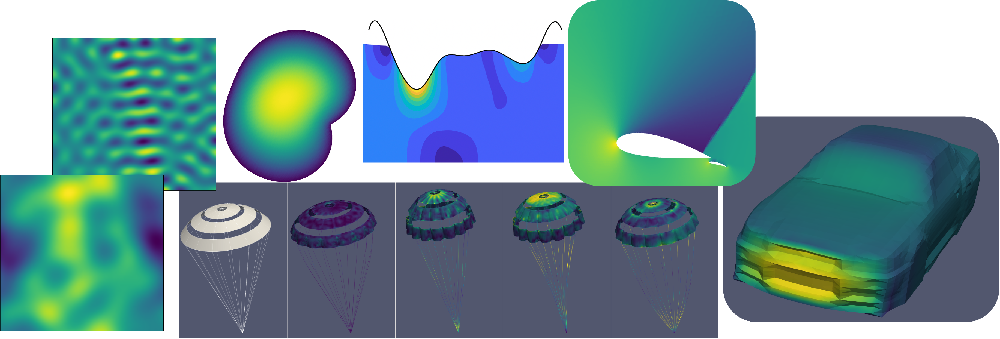

# NeuralOperator

NeuralOperator is

* An educational **Neural Operator** library. 
The goal is to provide students with a light-weighted code to explore this area 
and interactive lectures with amazing [Jupyter Notebook](https://jupyter.org/).
* A benchmark repository originally designed to test point cloud neural operator (PCNO) and other **neural operators**. 
The goal is to provide researchers with access to various parametric partial differential equations and associated datasets, 
enabling researchers to quickly and easily develop and test novel surrogate models.

## Code Structure
* Utilities for all neural networks, such as optimizers and normalizers are in the *utility* folder.
* State-of-the-art neural operators, including `fno.py`, are in the *baselines* folder.
* The Point Cloud Neural Operator (PCNO), Multiscale Point Cloud Neural Operator (MPCNO), and their related utility files are in the *pcno* folder. If you plan to design a new neural operator, consider starting a dedicated folder similar to *pcno*.
* Datasets should be downloaded into the *data* folder. Each subfolder contains one dataset, such as `darcy_square` for the Darcy flow problem in the unit square.
* Test scripts are in the *scripts* folder. Each subfolder contains scripts for various neural operators applied to a specific dataset, with the folder name matching the corresponding dataset subfolder in the *data* folder.

<pre style="white-space: pre-wrap;"><code>NeuralOperator/

├── utility/
│   ├── adam.py
│   ├── losses.py
│   ├── normalizer.py

├── baselines/
│   ├── (various state-of-the-art neural operators, such as fno.py)

├── pcno/
│   ├── pcno.py
|   ├── mpcno.py
│   ├── geo_utility.py

├── tests/
│   ├── __init__.py
│   ├── (various test files, such as pcno_test.py)

├── data/
│   ├── (various data folders, such as darcy_square)

├── scripts/
│   ├── (various test script folders, such as darcy_square)</code></pre>

## Tutorial
Let's start! (⚠️ under construction)

* Overview
    * [Surrogate Modeling](docs/surrogate_modeling.pdf)
    * [Python Naming Conventions](https://peps.python.org/pep-0008/#naming-conventions)
* Neural operator
    * [Fourier Neural Operator](docs/fno.ipynb)
    * [Point Cloud Neural Operator](docs/pcno.ipynb)
    * [Multiscale Point Cloud Neural Operator](docs/mpcno.ipynb)
* Example
    * [Advection-Diffusion Boundary Value Problem](scripts/adv_diff_bvp/README.md)  
        **Focus:** Adaptive meshing, Boundary layers, Different meshing strategies
    * [Darcy Flow Problem on Square Domain](scripts/darcy_square/README.md)  
        **Focus:** Benchmark, Different mesh resolutions, Restart training
    * [Darcy Flow Problem on Deformed Domain](scripts/deformed_domain_darcy/README.md)  
        **Focus:** Different mesh resolutions, Variable geometries
    * [Airfoil](scripts/airfoil/README.md)  
        **Focus:** Benchmark, Discontinuities (Shock wave)
    * [Airfoil with Flap](scripts/airfoil_flap/README.md)  
        **Focus:** Adaptive meshing, Topology variations, Discontinuities (Shock wave)  
    * [ShapeNet Car](scripts/car_shapenet/README.md)  
        **Focus:** Benchmark, Three-dimensional
    * [Ahmed Body](scripts/ahmed_body/README.md)  
        **Focus:** Benchmark, Three-dimensional, Large-scale
    * [Parachute Dynamics](scripts/parachute/README.md)  
        **Focus:** Three-dimensional, Unsteady problem
    * [Curve Integral](scripts/curve/README.md)
        **Focus:** Benchmark, Singular kernel integral on curves
    * [Mixed 3d](scripts/mixed_3d/README.md)
        **Focus:** Benchmark, Three-dimensional

## Submit an issue
You are welcome to submit an issue for any questions related to NeuralOperator. 

## Here are some research papers using NeuralOperator
1. Chenyu Zeng, Yanshu Zhang, Jiayi Zhou, Yuhan Wang, Zilin Wang, Yuhao Liu, Lei Wu, Daniel Zhengyu Huang, "[Point Cloud Neural Operator for Parametric PDEs on Complex and Variable Geometries](http://arxiv.org/abs/2501.14475)." 

