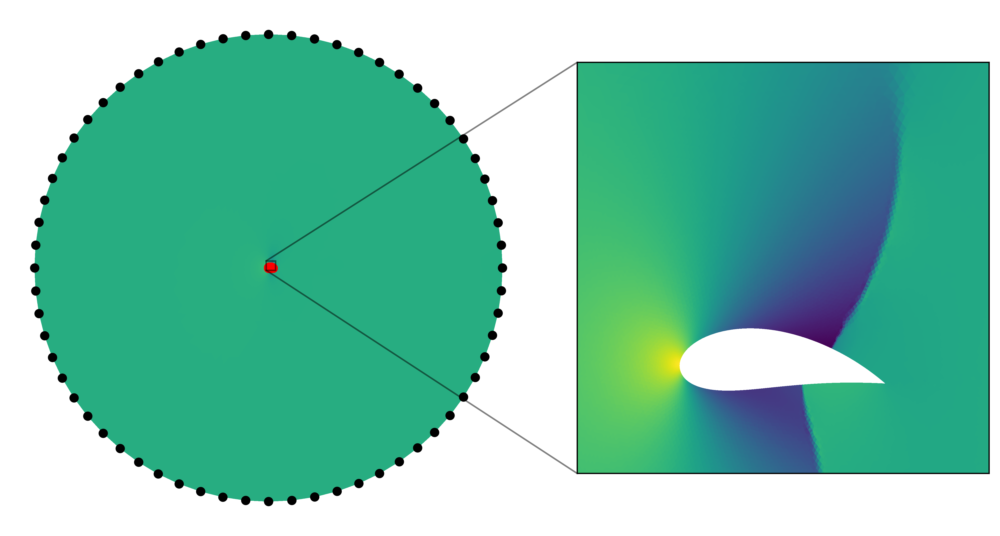
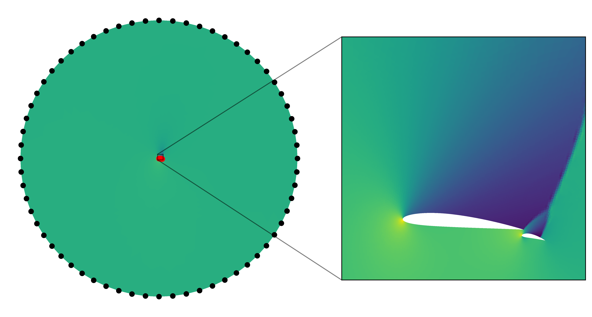

# Data Information

Download airfoil with flap data from 

PKU drive
https://disk.pku.edu.cn/link/AR64D4A8DC03C44E83832290D85B89322D
Name: airfoil_flap.zip

File Location: AnyShare://Neural-Operator-Data/airfoil_flap.zip


## Flies in the data
This dataset contains samples for two types of airfoil simulations: single-airfoil (Airfoil) and airfoil-with-flap (Airfoil + Flap).
<pre style="white-space: pre-wrap;"><code>NeuralOperator/
airfoil_flap/

├── Airfoil_data/(samples for single-airfoil)
│   ├── airfoil_mesh/
│       ├── (Data only at boundary)
│   ├── fluid_mesh/
│       ├── elems_00000.npy
│       ├── elems_00001.npy
│       ├── ......
│       ├── features_00000.npy
│       ├── features_00001.npy
│       ├── ......
│       ├── nodes_00000.npy
│       ├── nodes_00001.npy
│       ├── ......

├── Airfoil_flap_data/(samples for airfoil-with-flap)
│   ├── airfoil_mesh/
│       ├── (Data only at boundary)
│   ├── fluid_mesh/
│       ├── elems_00000.npy
│       ├── elems_00001.npy
│       ├── ......
│       ├── features_00000.npy
│       ├── features_00001.npy
│       ├── ......
│       ├── nodes_00000.npy
│       ├── nodes_00001.npy
│       ├── ......

├── Airfoil_residual.npy
├── Airfoil_flap_residual.npy
├── Data.ipynb
</code></pre>

- **`nodes_xxxxx.npy`**: These files contain the coordinates of the mesh nodes. The nodes represent the discretized points in the airfoil or airfoil-flap geometry. The shape is **(nnodes, 2)** 
- **`elems_xxxxx.npy`**: These files define the connectivity between the nodes, specifying which nodes form the triangle elements of the mesh. The shape is **(nelems, 3)**


For instance, visualizations of the mesh are shown below.


- **`features_xxxxx.npy`**: These files store the features for each element of the mesh, such as pressure or Mach number at the respective locations. The shape of the data is **(nnodes, 3)**, where:
  - **0**: Pressure
  - **1**: Mach number
  - **2**: Indicator (0: interior node, 1: airfoil node, 2: farfield node)

For instance, visualizations of the pressure are shown below.




# Running the Script
To preprocess the data before training, run the script with the preprocess_data argument:
```bash
python pcno_airfoilflap_test.py --preprocess_data True
```

You can run the script with customized parameters. For example:
```
python pcno_airfoilflap_test.py --train_type flap --feature_type pressure --n_train 500 --Lx 1.5 --Ly 0.7 --lr_ratio 5
```


# Parameters

| Name             | Type    | Default Value | Choices                              | Description                                                                                                                                                                                                        |
| ---------------- | ------- | ------------- | ------------------------------------ | ------------------------------------------------------------------------------------------------------------------------------------------------------------------------------------------------------------------ |
| `--train_type`   | `str`   | `mixed`       | `standard`, `flap`, `mixed`          | Specifies the type of training data:   - `standard`: Data from the airfoil without a flap.  - `flap`: Data from the airfoil with a - `mixed`: A balanced combination of standard and flap data.                    |
| `--feature_type` | `str`   | `pressure`        | `pressure`, `mach`         | Determines the feature type used as the output:      - `pressure`: Outputs the pressure field.     - `mach`: Outputs the Mach number|
| `--equal_weight` | `str`   | `True`, `False`        | `True`, `False`           | Specify whether to use equal weight   - `True`: Point cloud density - `False`: Uniform density|
| `--rho` | `str`   | `True`        | `True`, `False`           | Specify whether to include rho in the input|
| `--n_train`      | `int`   | `1000`        | `500`, `1000`, `1500`                | Number of training samples to use|
| `--n_test`       | `int`   | `400`         |              | Number of testing samples to use|
| `--train_sp_L`   | `str`   | `False`       | `False`, `together`, `independently` | Specifies whether the spatial length scales (`Lx`, `Ly`) are trained:  - `False`: Do not train the spatial length scales. - `together`: Train `Lx` and `Ly`  - `independently`: Train `Lx` and `Ly` independently. |
| `--Lx`           | `float` | `1.0`         |                                      | Initial value of the spatial length scale Lx.                                                                                                                                                                      |
| `--Ly`           | `float` | `0.5`         |                                      | Initial value of the spatial length scale Ly.                                                                                                                                                                      |
| `--normalization_x`           | `str` | `False`         |        `True`  ,`False`                           | Whether to normalize the x dimension                                                                                                                                                                    |
| `--normalization_y`           | `str` | `True`         |        `True`  ,`False`                            | Whether to normalize the y dimension                                                                                                                                                                    |
| --non_normalized_dim_x   | `int`  | `0`           |`0`, `1`                         | Specifies the dimension of x that should not be normalized. When `rho` is set to `True`, you can set `non_normalized_dim_x` to `1` to avoid normalizing rho|
| `--lr_ratio`     | `float` | `10`          |                                      | Learning rate ratio of main parameters and L parameters when train_sp_L is set to `independently`. |
| `--batch_size`     | `int` | `8`          |                                      | Batch size. |
---

The output file names will include the parameter values for traceability. For example:

```bash
PCNO_airfoilplap_mixed_mach_n1000_Lx1.0_Ly0.5_20250101_123030.pth
```