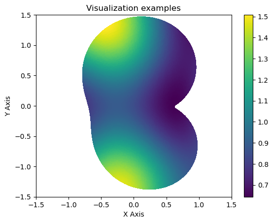
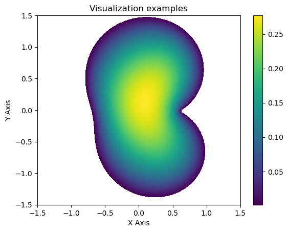

# Data Information

Download deformed domain darcy flow data  from 

PKU drive
https://disk.pku.edu.cn/link/AR1BA915DB5EC744EBAE9A0FDA531ADC87
Name: deformed_domain_darcy.zip

File Location: AnyShare://Neural-Operator-Data/deformed_domain_darcy.zip

# Flies in the data
This dataset contains samples for four types of deformed domain darcy flow simulations: 
- **`sharp_large_scale`**:  
  Stores 1000 solutions at the sharp coefficient and the large grid scale

- **`sharp_small_scale`**:  
  Stores 1000 solutions at the sharp coefficient and the small grid scale

- **`smooth_large_scale`**:  
  Stores 2000 solutions at the smooth coefficient and the large grid scale

- **`smooth_small_scale`**:  
  Stores 2000 solutions at the smooth coefficient and the small grid scale


<pre style="white-space: pre-wrap;"><code>

├── deformed_domain_darcy/
│   ├── sharp_large_scale/
│       ├── elems_00000.npy
│       ├── elems_00001.npy
│       ├── ......
│       ├── features_00000.npy
│       ├── features_00001.npy
│       ├── ......
│       ├── nodes_00000.npy
│       ├── nodes_00001.npy
│       ├── ......
│   ├── sharp_small_scale/
│       ├── ......
│   ├── smooth_large_scale/
│       ├── ......
│   ├── smooth_small_scale/
│       ├── ......

├── Data.ipynb
</code></pre>

- **`nodes_xxxxx.npy`**: These files contain the coordinates of the mesh nodes. The nodes represent the discretized points in the airfoil or airfoil-flap geometry. The shape is **(nnodes, 2)** 
- **`elems_xxxxx.npy`**: These files define the connectivity between the nodes, specifying which nodes form the triangle elements of the mesh. The shape is **(nelems, 4)** Contains the array `[elem_dim, e1, e2, e3]`, where:  
    - `elem_dim` specifies the dimensionality of the element:  
    - `2`: A triangle (surface element).  
    - `1`: A segment (line element).   
    For this case, elem_dim = 2
- **`features_xxxxx.npy`**: These files store the features for each element of the mesh. The shape of the data is **(nnodes, 2)**, where:
  - **0**: permeability field
  - **1**: reference solution

For instance, visualizations of the permeability field and reference solution are shown below.



# Running the Script
To preprocess the data before training, run the script with the preprocess_data argument:
```bash
python pcno_deformed_darcy.py  "preprocess_data"
```

You can run the script with customized parameters. For example:
```bash
python pcno_deformed_darcy.py --train_type mixed  --n_train 1000 --Lx 2.0 --Ly 2.0 --lr_ratio 5
```

# Parameters

| Name             | Type    | Default Value | Choices                              | Description                                                                                                                                                                                                        |
| ---------------- | ------- | ------------- | ------------------------------------ | ------------------------------------------------------------------------------------------------------------------------------------------------------------------------------------------------------------------ |
| `--train_type`   | `str`   | `mixed`       | `fine`, `coarse`, `mixed`          | Specifies the type of training data:   - `standard`: Data with fine meshes.  - `flap`: Data with coarse meshes- `mixed`: A balanced combination of fine and coarse data.                    |
| `--equal_weight` | `str`   |  `False`        | `True`, `False`           | Specify whether to use equal weight   - `True`: Point cloud density - `False`: Uniform density|
| `--n_train`      | `int`   | `1000`        | `500`, `1000`, `1500`                | Number of training samples to use|
| `--n_test`       | `int`   | `200`         |              | Number of testing samples to use|
| `--train_sp_L`   | `str`   | `False`       | `False`, `together`, `independently` | Specifies whether the spatial length scales (`Lx`, `Ly`) are trained:  - `False`: Do not train the spatial length scales. - `together`: Train `Lx` and `Ly`  - `independently`: Train `Lx` and `Ly` independently. |
| `--Lx`           | `float` | `2.0`         |                                      | Initial value of the spatial length scale Lx.                                                                                                                                                                      |
| `--Ly`           | `float` | `2.0`         |                                      | Initial value of the spatial length scale Ly.                                                                                                                                                                      |
| `--normalization_x`           | `str` | `False`         |        `True`  ,`False`                           | Whether to normalize the x dimension                                                                                                                                                                    |
| `--normalization_y`           | `str` | `False`         |        `True`  ,`False`                            | Whether to normalize the y dimension                                                                                                                                          |
| `--lr_ratio`     | `float` | `5`          |                                      | Learning rate ratio of main parameters and L parameters when train_sp_L is set to `independently`. |
| `--batch_size`     | `int` | `8`          |                                      | Batch size. |
---


