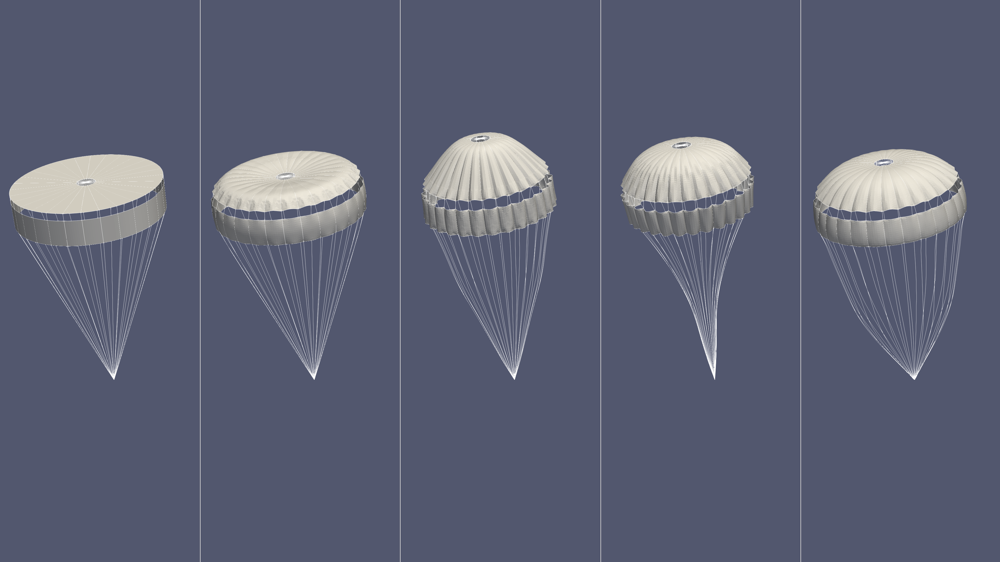

# Data Information

## Data Download
Download parachute problem data from 
- PKU drive: https://disk.pku.edu.cn/link/AA34CF034A452D4DEE9CEB7671567C4E62
- Name of the data file: parachute.zip


## Flies in the data
This dataset includes information for three types of parachutes:  

1. **DGB (Disk-Gap-Band)**:  
   A parachute consisting of three parts: a disk, a gap, and a band.  

2. **Arc**:  
   A parachute with a circular arc shape, featuring a vent and two gaps.  

3. **Ribbon**:  
   A one-piece parachute with a conical shape, including a vent and two reinforcement zonal lines.  

Each data folder contains 2000 parachutes(from 0 to 1999).
<pre style="white-space: pre-wrap;"><code>
├── parachute/
│   ├── DGB/
│       ├── elements_00000.npy
│       ├── elements_00001.npy
│       ├── ......
│       ├── features_00000.npy
│       ├── features_00001.npy
│       ├── ......
│       ├── nodes_00000.npy
│       ├── nodes_00001.npy
│       ├── ......
│   ├── Arc/
│       ├── ......
│   ├── Ribbon/
│       ├── ......
│   ├── Data.ipynb
</code></pre>

- **`nodes_XXXXX.npy`**:  
  Stores the `x`, `y`, and `z` coordinates of the initial shape.  

- **`elems_XXXXX.npy`**:  
  Contains the array `[elem_dim, e1, e2, e3]`, where:  
  - `elem_dim` specifies the dimensionality of the element:  
    - `2`: A triangle (fabric element).  
    - `1`: A segment (line element).  
  - For line elements (`elem_dim = 1`):  
    - `e1 = -1`.  
    - `e2` and `e3` are the nodal indices starting from 0.  
  - For fabric elements (`elem_dim = 2`):  
    - `e1`, `e2`, and `e3` are the nodal indices starting from 0.  

- **`features_XXXXX.npy`**:  
  Contains:  
  - The nodal displacements as 3D vectors recorded at 51 time steps with pressure load 1000Pa (linearly increse from 0 to 1000 in the first 0.1 second):  
    `t = 0, t = 0.004, t = 0.008, ..., t = 0.2`.  
  - An indicator array, where a value of `1` marks a node as being on a line, and `0` otherwise.  

For instance, visualizations of the parachute are shown below.(From top to bottom are DGB, Arc and Robbin)



# Running the Script
To preprocess the data before training, run the script with the preprocess_data argument:
```bash
python pcno_parachute_test.py  "preprocess_data"
```

You can run the script with customized parameters. For example:
```bash
python pcno_parachute_test.py  --train_sp_L together 
```


## Parameters

| Name             | Type    | Default Value | Choices                              | Description                                                                                                                                                                                                        |
| ------------------ | ------- | ------------- | ------------------------------------ | ------------------------------------------------------------------------------------------------------------------------------------------------------------------------------------------------------------------ |
| `--equal_weight` | `str`   |  `False`        | `True`, `False`           | Specify whether to use equal weight   - `True`: Point cloud density - `False`: Uniform density|
| `--train_sp_L`   | `str`   | `False`       | `False`, `together`, `independently` | Specifies whether the spatial length scales (`Lx`, `Ly`) are trained:  - `False`: Do not train the spatial length scales. - `together`: Train `Lx` and `Ly`  - `independently`: Train `Lx` and `Ly` independently. |                                               
| `--lr_ratio`     | `float` | `10`          |                                      | Learning rate ratio of main parameters and L parameters when train_sp_L is set to `independently`. |
| `--batch_size`     | `int` | `4`          |                                      | Batch size. |
---
